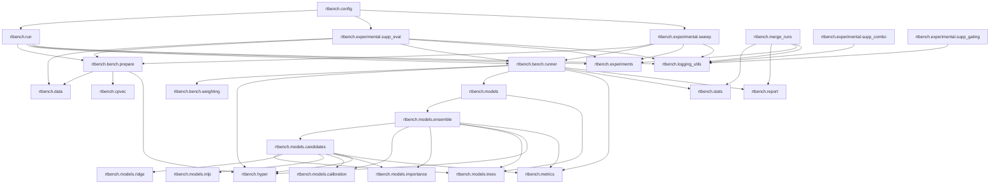
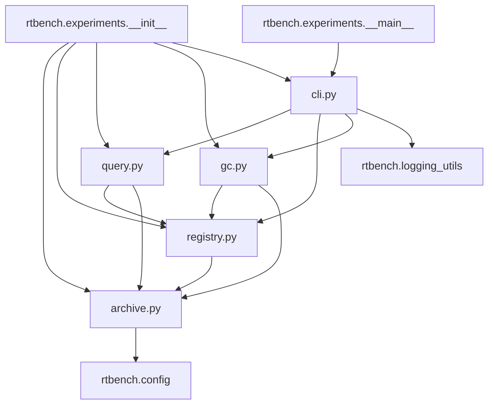
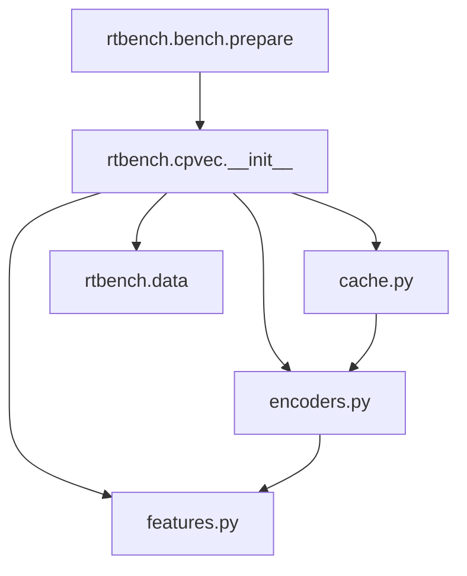
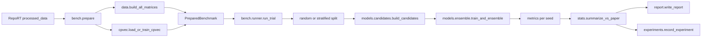

# RTBench Architecture

This document tracks the code as it is imported today. The Mermaid graphs below were aligned against the package imports under `rtbench/`, not against an intended future state.

## Runtime Module Graph



`rtbench.experimental.supp_eval` and `rtbench.experimental.sweep` are the two experimental entrypoints that actually drive the benchmark pipeline. `supp_combo` and `supp_gating` stay outside `bench/` and `models/`; they consume precomputed supplementary outputs and policy YAML files directly.

## Experiments Package Split

`rtbench.experiments` is now a package facade. The public API stayed stable while the implementation moved into focused modules.



Responsibilities:

1. `archive.py`
   Stores resolved-config snapshots, SHA1 helpers, and catalog resolution for archived configs.
2. `registry.py`
   Owns registry CRUD, migration, discovery of run directories, and temporary-output cleanup manifests.
3. `query.py`
   Implements `query_experiments()` and `compare_experiments()`.
4. `gc.py`
   Wraps registry-aware garbage collection and dry-run reporting.
5. `cli.py`
   Hosts the argparse entrypoint used by `python -m rtbench.experiments`.

## CPVec Package Split

`rtbench.cpvec` is also a facade package now. `bench.prepare` still imports a single stable entrypoint, but caching, feature extraction, and encoder training no longer live in one file.



Responsibilities:

1. `features.py`
   Gradient-segment extraction, column-name tokenization, unit scaling, and numeric coercion.
2. `encoders.py`
   AE-1, AE-2, Word2Vec training, normalization, and the `CPEncoder` runtime object.
3. `cache.py`
   Cache directory hashing plus `meta.json`, NumPy, and PyTorch artifact persistence.
4. `__init__.py`
   Public facade for `ensure_cp_inputs()`, `list_all_study_ids()`, and `load_or_train_cpvec()`.

## Data Flow



In practice:

1. `bench.prepare` validates RepoRT inputs, trains or loads CP vectors when enabled, and materializes dataset matrices.
2. `bench.runner` assembles source and target splits, target transforms, optional Hyper-TL pretraining, and candidate evaluation loops.
3. `models.candidates.build_candidates()` collects transfer, local, Hyper-TL, anchor, MDL-subset, ridge, and MLP candidates behind one stable interface.
4. `models.ensemble.train_and_ensemble()` calibrates candidates, ranks them, solves fusion weights, and emits final validation and test predictions.
5. `stats`, `report`, and `experiments` turn seed-level outputs into summary CSVs, Markdown reports, and registry entries that remain resumable and traceable.

## Config Inheritance

Main benchmark configs use `_base` inheritance through four shared base files:

```text
_base_rplc_14x14.yaml
- dataset scope, baseline paths, paper metrics, split defaults, stats defaults
_base_transfer.yaml
- transfer weighting and target-transform defaults
_base_models_tree.yaml
- transfer and local tree defaults plus early-stopping knobs
_base_cpvec.yaml
- CPEncoder defaults for Word2Vec plus AE-1 and AE-2
```

Common derived families:

```text
rplc_14x14*.yaml
- trees and hybrid variants -> _base_rplc_14x14 + _base_transfer + _base_models_tree
- hyper variants -> _base_rplc_14x14 + _base_transfer
- cpvec variants -> add _base_cpvec

quick6*.yaml / micro_*.yaml
- reduced external dataset subsets layered on the same bases

supp_eval_single_task_v*.yaml
- single-dataset supplementary runs layered on the shared benchmark bases
```

The `supp_s4_*` policy files intentionally do not use `_base`. They are standalone YAML inputs consumed directly by `rtbench.experimental.supp_combo` and `rtbench.experimental.supp_gating`.

## Experiment Workflow

1. Create or copy a config under `configs/`, preferably as a thin child over `_bases/`.
2. Run `python -m rtbench.run --config ...` or one of the experimental entrypoints to write predictions, metrics, `config.sha1`, `config.resolved.yaml`, and logs under the configured output root.
3. `rtbench.experiments.record_experiment()` appends or refreshes the corresponding row in `experiments/registry.csv`.
4. `python -m rtbench.experiments query|compare|gc ...` reads the same registry facade without reaching back into benchmark training code.
5. Archived or moved configs continue to resolve historically through `experiments/registry.csv`, `experiments/archived_configs.csv`, and `experiments/configs/*.yaml`.
